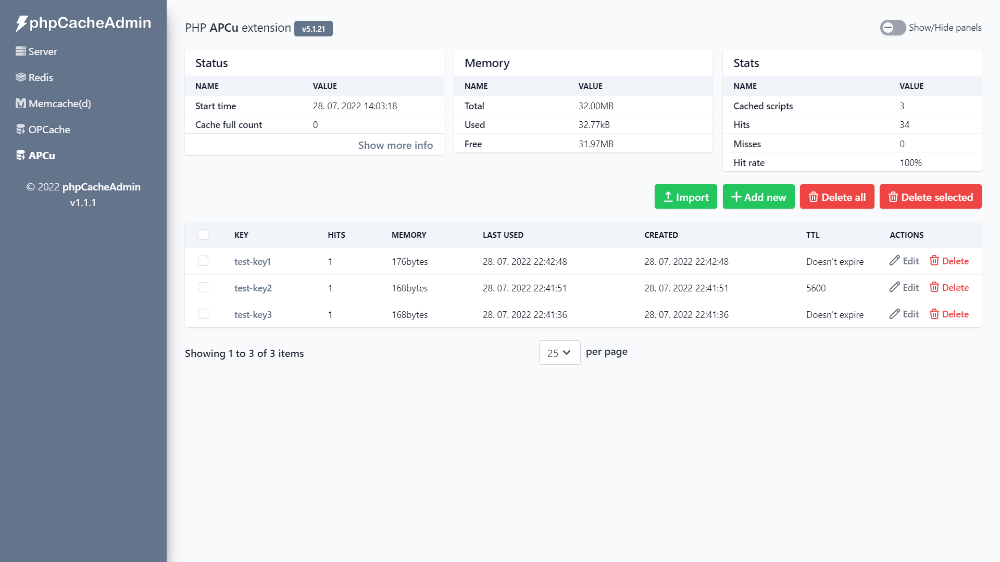

<p align="center"></p>
<p align="center">A web dashboard for your favorite caching system.</p>


<table>
  <tr>
    <td></td>
    <td></td>
  </tr>
  <tr>
    <td></td>
    <td></td>
  </tr>
</table>

<div align="center">
  

  Server tab (default)
</div>

## Installation

Simply extract the content. Optional but highly recommended, run `composer install` before use.

If you need to customize or add servers to the configuration file,
do not edit `config.dist.php` directly, but copy it to `config.php`.

## Updating

Replace all files and delete the `cache` folder.

> **Note**
>
> `Cache` folder contains optimized Twig templates for faster page loading.
> However, when changes are made to the Twig files, the cache will not change
> (unless you have `twigdebug` enabled or delete folder).

## Docker

https://hub.docker.com/r/robinn/phpcacheadmin

Run with single command:

```
docker run -p 8080:80 -d --name phpcacheadmin -e "PCA_REDIS_0_HOST=redis_host" -e "PCA_REDIS_0_PORT=6379" -e "PCA_MEMCACHED_0_HOST=memcached_host" -e "PCA_MEMCACHED_0_PORT=11211" robinn/phpcacheadmin
```

Or simply use it in **docker-compose.yml**

```yaml
version: '3'

services:
  phpcacheadmin:
    image: robinn/phpcacheadmin
    ports:
      - "8080:80"
    environment:
      - PCA_REDIS_0_HOST=redis
      - PCA_REDIS_0_PORT=6379
      - PCA_MEMCACHED_0_HOST=memcached
      - PCA_MEMCACHED_0_PORT=11211
    links:
      - redis
      - memcached
  redis:
    image: redis
  memcached:
    image: memcached
```

> **Note**
>
> It is not required to have both Redis and Memcached.

#### Environment variables

Redis:

- `PCA_REDIS_0_NAME` The server name for an info panel. Optional.
- `PCA_REDIS_0_HOST` Redis host. Optional, when a `path` is specified.
- `PCA_REDIS_0_PORT` Redis port. Optional, when the default port is used.
- `PCA_REDIS_0_DATABASE` Redis database. Optional.
- `PCA_REDIS_0_USERNAME` Redis username. Optional, requires Redis >= 6.0.
- `PCA_REDIS_0_PASSWORD` Redis password. Optional.
- `PCA_REDIS_0_PATH` Redis unix domain socket. Optional.

Memcached:

- `PCA_MEMCACHED_0_NAME` The server name for an info panel. Optional.
- `PCA_MEMCACHED_0_HOST` Memcached host. Optional, when a `path` is specified.
- `PCA_MEMCACHED_0_PORT` Memcached port. Optional, when the default port is used.
- `PCA_MEMCACHED_0_PATH` Memcached unix domain socket. Optional.

To add another server, add the same environment variables, but change 0 to 1 (2 for third server and so on).

## Requirements

- PHP >= 7.4
- redis, memcache(d), opcache or apcu php extensions (if none of them is installed, only the Server tab will be available)
- Memcached server >= 1.4.18

## Testing

PHPUnit

```
composer test
```

PHPStan

```
composer phpstan
```

## Development

For compiling Tailwind CSS run `npm install` and then
`npm run build` or `npm run watch` for auto-compiling.

<!-- Font used in logo Arial Rounded MT Bold -->
