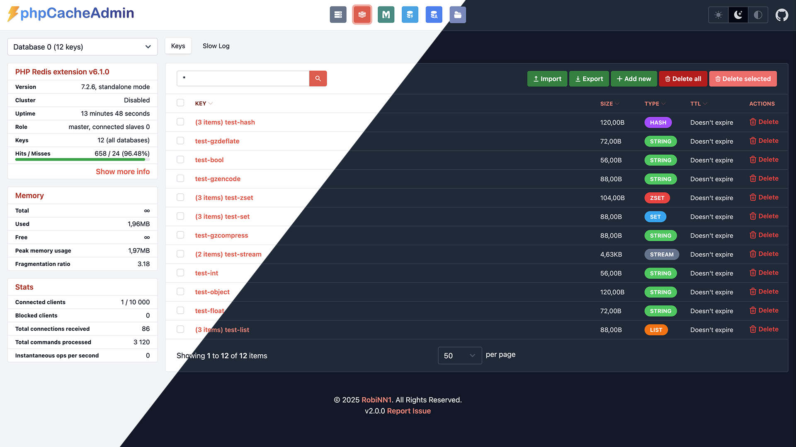

<p align="center"></p>
<p align="center">Web GUI for managing Redis, Memcached, APCu, OPCache and Realpath with data management.</p>
<p align="center"></p>


## Features

A modern, easy-to-use web GUI for your favorite cache systems, think of it as phpMyAdmin but for caching!

### General
- Clean, responsive interface with a **Dark Mode**.
- Switch between multiple configured servers for Redis, Memcached.
- Back up and restore your data.
- Quickly find keys across your cache.
- **No composer required to run**.
- **Docker ready**.

### Redis
- Works with both **phpredis** and **Predis** clients.
- View, add, edit, and delete keys. Supports all Redis data types.
- **Cluster support**.
- Supports ACL.
- Detailed server statistics including memory usage, uptime, connected clients, and general info.
- View the Redis slowlog to debug performance issues.

### Memcached
- Uses a custom client, so **no memcache(d) extension** is required.
- View, add, edit, and delete keys.
- Server Stats including uptime, memory usage, connections, and more.
- Slabs & Items info.
- Commands Stats.

### PHP Caches
- **APCu**:
    - View, edit, and delete user-cached entries.
    - View cache information and memory usage statistics.
- **OPcache**:
    - View and invalidate cached scripts.
    - Get statistics on memory usage, hit rates, and cached keys.
- **Realpath Cache**:
    - View and clear PHP's realpath cache entries.

## Installation

Unzip the archive and launch index.php in a web browser. No installation is required.
However, it is highly recommended (although not required) to run `composer install`.

If you use the defaults (e.g. Redis, Memcached servers), everything should work out of the box.
To customize the configuration, do not edit `config.dist.php` directly, but copy it into `config.php`.

## Updating

Replace all files and delete the `tmp` folder (this folder contains only compiled Twig templates).

## Environment variables

All keys from the [config](https://github.com/RobiNN1/phpCacheAdmin/blob/master/config.dist.php) file are supported ENV variables,
they just must start with `PCA_` prefix.

Options with an array can be set using "dot notation" but use `_` instead of a dot.
Or you can even use JSON (e.g. Redis SSL option).

Redis:

- `PCA_REDIS_0_NAME` The server name (optional).
- `PCA_REDIS_0_HOST` Optional when a path or nodes is specified.
- `PCA_REDIS_0_NODES` List of cluster nodes. You can set value as JSON `["127.0.0.1:7000","127.0.0.1:7001","127.0.0.1:7002"]`.
- `PCA_REDIS_0_PORT` Optional when the default port is used.
- `PCA_REDIS_0_SCHEME` Connection scheme (optional). If you need a TLS connection, set it to `tls`.
- `PCA_REDIS_0_SSL` [SSL options](https://www.php.net/manual/en/context.ssl.php) for TLS. Requires Redis >= 6.0 (optional). You can set value as JSON `{"cafile":"private.pem","verify_peer":true}`.
- `PCA_REDIS_0_DATABASE` Default database (optional).
- `PCA_REDIS_0_USERNAME` ACL - requires Redis >= 6.0 (optional).
- `PCA_REDIS_0_PASSWORD` Optional.
- `PCA_REDIS_0_AUTHFILE` File with a password, e.g. Docker secrets (optional).
- `PCA_REDIS_0_PATH` Unix domain socket (optional).
- `PCA_REDIS_0_DATABASES` Number of databases, use this if the CONFIG command is disabled (optional).
- `PCA_REDIS_0_SCANSIZE` Number of keys, the server will use the SCAN command instead of KEYS (optional).

Memcached:

- `PCA_MEMCACHED_0_NAME` The server name (optional).
- `PCA_MEMCACHED_0_HOST` Optional when a path is specified.
- `PCA_MEMCACHED_0_PORT` Optional when the default port is used.
- `PCA_MEMCACHED_0_PATH` Unix domain socket (optional).

PHP:
- `PCA_PHP_MEMORY_LIMIT` In case you need to increase the PHP memory limit in Docker.

Open the [config](https://github.com/RobiNN1/phpCacheAdmin/blob/master/config.dist.php) file for more info.

> To add another server, add the same environment variables, but change `0` to `1` (`2` for third server and so on).

## Docker

A Docker image is also available: https://hub.docker.com/r/robinn/phpcacheadmin

Run with a single command:

```bash
docker run -p 8080:80 -d --name phpcacheadmin -e "PCA_REDIS_0_HOST=redis_host" -e "PCA_REDIS_0_PORT=6379" -e "PCA_MEMCACHED_0_HOST=memcached_host" -e "PCA_MEMCACHED_0_PORT=11211" robinn/phpcacheadmin
```

Or use it in **docker-compose.yml**

```yaml
services:
  phpcacheadmin:
    image: robinn/phpcacheadmin
    ports:
      - "8080:80"
    #volumes:
    # If you want to use config.php instead of ENV variables
    #  - "./config.php:/var/www/html/config.php"
    environment:
      - PCA_REDIS_0_HOST=redis
      - PCA_REDIS_0_PORT=6379
      - PCA_MEMCACHED_0_HOST=memcached
      - PCA_MEMCACHED_0_PORT=11211
    links:
      - redis
      - memcached
  redis:
    image: redis
  memcached:
    image: memcached
```

## Requirements

- PHP >= 8.2 (Use [v1 branch](https://github.com/RobiNN1/phpCacheAdmin/tree/v1.x) if you need support for >=7.4)
- Redis server >= 4.0
- Memcached server >= 1.4.31. SASL is not supported because there is no way to get the keys.

> It is not necessary to have all dashboards enabled.

## Custom Dashboards

- [FileCache](https://github.com/RobiNN1/FileCache-Dashboard) ([`robinn/cache`](https://github.com/RobiNN1/Cache)) dashboard.

## Contributing

Thank you for your interest in contributing! However, this project is not accepting pull requests as I prefer to maintain the codebase myself.

If you encounter any issues or have suggestions for improvements, please create an issue instead. This allows us to discuss the problem or idea before any changes are made.

I appreciate your understanding and look forward to hearing your feedback!

<!-- Font used in logo Arial Rounded MT Bold -->
