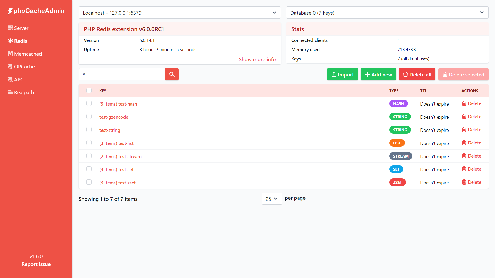
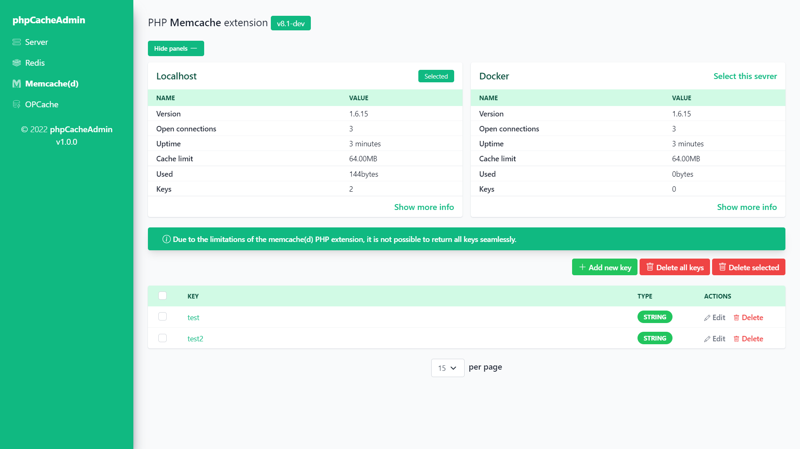
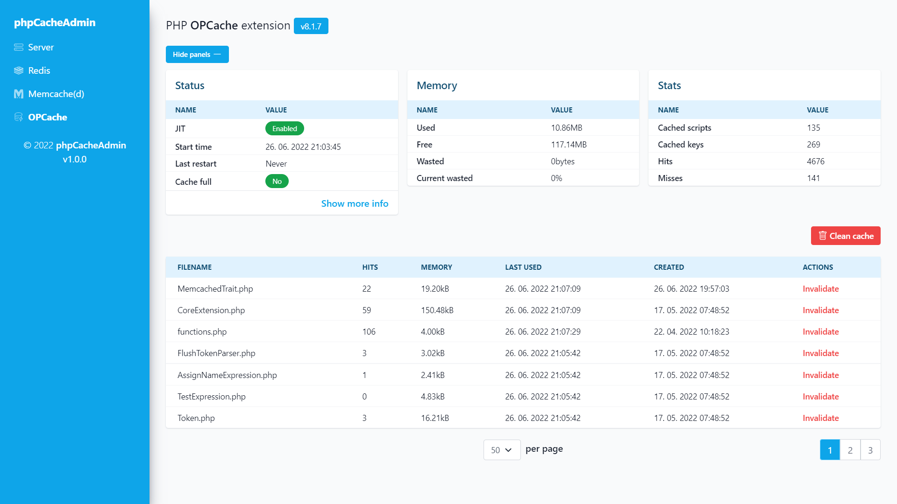
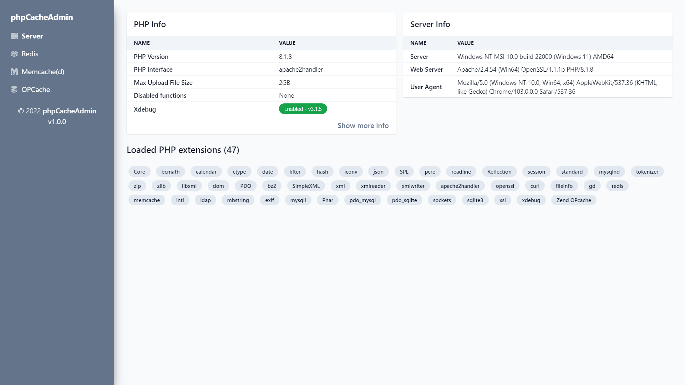

# phpCacheAdmin

Web dashboard for Redis, Memcache(d) and OPCache.

| Redis                           | Memcache(d)                               |
|---------------------------------|-------------------------------------------|
|  |  |

| OPCache                             | Server tab (default)                   |
|-------------------------------------|----------------------------------------|
|  |  |

## Installation

Simply extract the content. Optional but highly recommended, run `composer install` before use.

If you need to customize or add servers in the configuration file, do not edit `config.dist.php` directly,
copy `config.dist.php` to `config.php` instead.

## Updating

Replace all files and delete the `cache` folder.
This folder contains optimized Twig templates for faster page loading.

## Docker

There is no official image yet,
but you can create your own and set ENV variables such as these
`PCA_REDIS_0_HOST=127.0.0.1`, `PCA_REDIS_0_PORT=6379`.

You can change any config option, it just must have `PCA_` prefix.

## Requirements

- PHP >= 7.4
- redis, memcache(d) or opcache php extensions (if none of them is installed, only the Server tab will be available)

## Development

For compiling Tailwind CSS run `npm install` and then
`npm run build` or `npm run watch` for auto-compiling.
