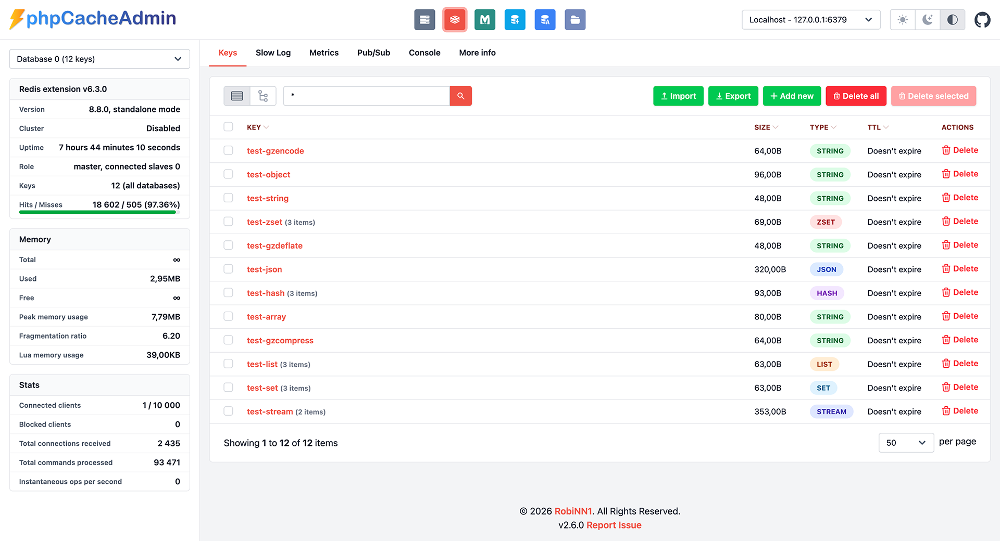

<p align="center"></p>
<p align="center">Web GUI for managing Redis, Memcached, APCu, OPCache, and Realpath with data management.</p>
<p align="center"><strong><a href="https://phpcacheadmin.com/">phpcacheadmin.com</a></strong></p>
<p align="center">
  <picture>
    <source media="(prefers-color-scheme: dark)" srcset=".github/img/redis-dark.png">
    
  </picture>
</p>


## Features

### General

- Clean, responsive interface with a **Dark Mode**.
- Switch between multiple configured servers for Redis, Memcached.
- Back up and restore your data.
- Quickly find keys across your cache.
- View any key's details in a **modal** without leaving the list.
- Optional **login page** with basic authentication (enabled by defining users in `authusers`).
- **No composer required to run**.
- **Docker ready**.

### Redis

- Works with both **phpredis** and **Predis** clients.
- View, add, edit, and delete keys. Supports all Redis data types.
- Search within a key's sub-items (hash fields, set/list/sorted set members).
- **Analysis** of the keyspace - memory by namespace, biggest keys, keys with the most items, data type distribution
and a TTL summary, sampled with SCAN. Includes **recommendations** weighed against the server's own `maxmemory`, eviction policy and encoding limits.
- **Console** for running Redis commands interactively.
- **PUB/SUB** support to browse channels, subscribe, and publish messages.
- **Cluster support**.
- Supports ACL.
- Detailed server statistics including command calls, memory usage, uptime, connected clients, and general info.
- View the Redis slowlog to debug performance issues.
- Supports both SCAN and KEYS commands for retrieving keys.

### Memcached

- Uses a custom client, so **no memcache(d) extension** is required.
- View, add, edit, and delete keys.
- **Analysis** of the keyspace - memory by namespace, biggest keys, and an expiration and last-used summary.
- **Console** for running Memcached commands interactively.
- Server Stats including uptime, memory usage, connections, and more.
- Slabs & Items info.
- Commands Stats.

### PHP Caches

- **APCu**:
    - View, edit, and delete user-cached entries.
    - View cache information and memory usage statistics.
- **OPcache**:
    - View and invalidate cached scripts.
    - Get statistics on memory usage, hit rates, and cached keys.
    - **Treemap** visualization of cached scripts by memory usage.
- **Realpath Cache**:
    - View and clear PHP's realpath cache entries.

## Installation

Unzip the archive and launch index.php in a web browser. No installation is required.

If you use the defaults (e.g., Redis, Memcached servers), everything should work out of the box.
To customize the configuration, do not edit `config.dist.php` directly, but copy it into `config.php`.

## Updating

Replace all files and delete the `/tmp/twig` folder (it contains compiled Twig templates).

## Common issues

If you get the error "Fatal error: Allowed memory size of x bytes exhausted" or a blank page, increase the PHP memory
limit or enable the SCAN command (set `PCA_REDIS_0_SCANSIZE` or uncomment `scansize` in `config.php`).
For Redis databases with more than 100 000 keys, SCAN is used automatically (the limit is configurable with `scanthreshold`).

## Cronjob

You can add these links to your cronjob to collect metrics when the dashboard is not open:

Redis `https://example.com/phpCacheAdmin/?dashboard=redis&server=0&ajax&metrics`

Memcached `https://example.com/phpCacheAdmin/?dashboard=memcached&server=0&ajax&metrics`

> `server=0` is the default server ID.

Metrics are collected whenever this link is refreshed, so you can set any time in the cronjob.

If you have authentication enabled, set `authtoken` in `config.php` and append `&token=your-secret-token`
to the cronjob URL so it can collect metrics without a login session.

## Environment variables

All keys from the [config](https://github.com/RobiNN1/phpCacheAdmin/blob/master/config.dist.php) file are supported ENV variables,
they just must start with `PCA_` prefix.

Options with an array can be set using "dot notation" but use `_` instead of a dot.
Or you can even use JSON (e.g., Redis SSL option).

Redis:

- `PCA_REDIS_0_NAME` The server name (optional).
- `PCA_REDIS_0_HOST` Optional when a path or nodes is specified.
- `PCA_REDIS_0_NODES` List of cluster nodes. You can set value as JSON `["127.0.0.1:7000","127.0.0.1:7001","127.0.0.1:7002"]`.
- `PCA_REDIS_0_PORT` Optional when the default port is used.
- `PCA_REDIS_0_SCHEME` Connection scheme (optional). If you need a TLS connection, set it to `tls`.
- `PCA_REDIS_0_SSL` [SSL options](https://www.php.net/manual/en/context.ssl.php) for TLS. Requires Redis >= 6.0 (optional). You can set value as JSON `{"cafile":"private.pem","verify_peer":true}`.
- `PCA_REDIS_0_DATABASE` Default database (optional).
- `PCA_REDIS_0_USERNAME` ACL - requires Redis >= 6.0 (optional).
- `PCA_REDIS_0_PASSWORD` Optional.
- `PCA_REDIS_0_AUTHFILE` File with a password, e.g., Docker secrets (optional).
- `PCA_REDIS_0_PATH` Unix domain socket (optional).
- `PCA_REDIS_0_DATABASES` Number of databases, use this if the CONFIG command is disabled (optional).
- `PCA_REDIS_0_SCANTHRESHOLD` Use SCAN automatically instead of KEYS when the database has more keys than this, 1000 keys are retrieved (optional). Default 100_000.
- `PCA_REDIS_0_SCANSIZE` Always use SCAN and retrieve at most this many keys, regardless of the threshold (optional).

Memcached:

- `PCA_MEMCACHED_0_NAME` The server name (optional).
- `PCA_MEMCACHED_0_HOST` Optional when a path is specified.
- `PCA_MEMCACHED_0_PORT` Optional when the default port is used.
- `PCA_MEMCACHED_0_PATH` Unix domain socket (optional).

Other:

- `PCA_PHP_MEMORY_LIMIT` In case you need to increase the PHP memory limit in Docker.
- `PCA_NGINX_PORT` In case you need to change NGINX port in Docker.

Open the [config](https://github.com/RobiNN1/phpCacheAdmin/blob/master/config.dist.php) file for more info.

> To add another server, add the same environment variables, but change `0` to `1` (`2` for third server and so on).

### .env files

You can keep these variables in a `.env` file instead of exporting them in the shell.
This requires [vlucas/phpdotenv](https://github.com/vlucas/phpdotenv):

```bash
composer require vlucas/phpdotenv
```

Copy [.env.example](https://github.com/RobiNN1/phpCacheAdmin/blob/master/.env.example) to `.env` and adjust the values.
The following files are loaded automatically (in order of precedence, the more specific file wins):

1. `.env.{environment}.local`
2. `.env.{environment}`
3. `.env.local`
4. `.env`

`{environment}` comes from the `PCA_ENV` (or `APP_ENV`) variable, e.g., `PCA_ENV=development` also loads `.env.development`.
This lets you keep committed defaults in `.env` and override them locally in `.env.local`, which is git-ignored.

Real environment variables (e.g., set by Docker) always take precedence over the values in `.env` files,
so you can still override anything at runtime.

## Docker

A Docker image is also available: https://hub.docker.com/r/robinn/phpcacheadmin

Run with a single command:

```bash
docker run -p 8080:80 -d --name phpcacheadmin -e "PCA_REDIS_0_HOST=redis_host" -e "PCA_REDIS_0_PORT=6379" -e "PCA_MEMCACHED_0_HOST=memcached_host" -e "PCA_MEMCACHED_0_PORT=11211" robinn/phpcacheadmin
```

Or use it in **docker-compose.yml**

```yaml
services:
  phpcacheadmin:
    image: robinn/phpcacheadmin
    ports:
      - "8080:80"
    #volumes:
    # If you want to use config.php instead of ENV variables
    #  - "./config.php:/var/www/html/config.php"
    environment:
      - PCA_REDIS_0_HOST=redis
      - PCA_REDIS_0_PORT=6379
      - PCA_MEMCACHED_0_HOST=memcached
      - PCA_MEMCACHED_0_PORT=11211
    links:
      - redis
      - memcached
  redis:
    image: redis
  memcached:
    image: memcached
```

## Requirements

- PHP >= 8.2 (Use [v1 branch](https://github.com/RobiNN1/phpCacheAdmin/tree/v1.x) if you need support for >=7.4)
- Redis server >= 4.0
- Memcached server >= 1.4.31. SASL is not supported because there is no way to get the keys
- sqlite3 extension for metrics

> It is not necessary to have all dashboards enabled.

## Custom Dashboards

Here is an example of how to implement a custom dashboard

- [FileCache](https://github.com/RobiNN1/FileCache-Dashboard) ([`robinn/cache`](https://github.com/RobiNN1/Cache)) dashboard.

## Contributing

If you have a feature request, suggestion, or have found a bug, 
please open an Issue describing what you would like to see.
AI tools are fine, but unchecked AI-generated code with irrelevant changes is not.
Discussing your ideas first saves everyone's time and prevents rejected contributions.


<!-- Font used in logo Arial Rounded MT Bold -->
